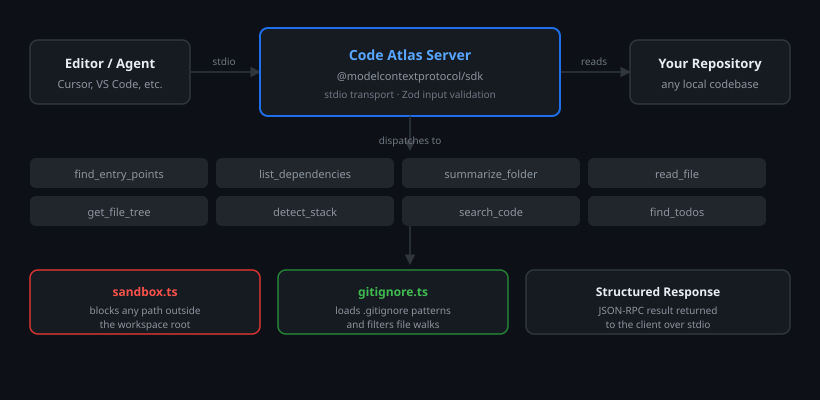

# Code Atlas: MCP Server for Codebase Analysis

Code Atlas is a Model Context Protocol (MCP) server that gives any MCP-compatible editor or agent a structured set of tools to read, search, and understand a codebase. Connect it once and your assistant can map entry points, trace imports, detect the stack, grep across the repo, and surface TODOs without you having to do any of it manually.

Built for developers who want their AI assistant to actually understand the project, not just guess at it.



## What It Can Do

- **Find Entry Points:** Scans the workspace and returns all entry point files such as `index.ts`, `main.py`, and `Dockerfile`
- **List Dependencies:** Traces all local imports inside a given file
- **Summarize Folder:** Identifies the architectural role of a folder (API layer, models, utilities, tests, and more)
- **Read File:** Reads any file in the workspace safely, sandboxed to the project root
- **Get File Tree:** Returns the full directory structure as a readable tree, filtered by `.gitignore`
- **Detect Stack:** Reads `package.json`, `Dockerfile`, `requirements.txt`, `go.mod`, and similar files to identify the tech stack
- **Search Code:** Searches all non-ignored files for a keyword or regex pattern, returning results with file path and line number
- **Find TODOs:** Collects every `TODO`, `FIXME`, `HACK`, and `NOTE` comment across the codebase, grouped by file

## Architecture

**Server:** TypeScript with `@modelcontextprotocol/sdk` over stdio transport

**Schema Validation:** Zod for all tool input definitions

**Security:** Every tool routes through `safePath()` which resolves inputs to absolute paths and rejects anything outside the workspace root, including sibling directories that share a name prefix

**Filtering:** `.gitignore` patterns are loaded at runtime and applied across all file-walking tools

## Getting Started

### Prerequisites

- [Node.js](https://nodejs.org/) v18 or higher
- npm (comes with Node.js)

Verify your setup:

```bash
node -v
npm -v
```

### Installation

```bash
git clone https://github.com/bhavjsh/code-atlas.git
cd code-atlas
npm install
npm run build
```

### Running the Server

```bash
npm start
```

For development without a build step:

```bash
npm run dev
```

## Connecting to an MCP Client

Add this to your MCP client configuration file, replacing the path with the actual location on your machine:

```json
{
  "mcpServers": {
    "code-atlas": {
      "command": "node",
      "args": ["/absolute/path/to/code-atlas/dist/index.js"]
    }
  }
}
```

Restart your client. All 8 tools will be available immediately. Compatible with any host that supports the MCP stdio transport including Cursor and VS Code MCP extensions.

## Project Structure

```
code-atlas/
├── src/
│   ├── index.ts
│   ├── tools/
│   │   ├── findEntryPoints.ts
│   │   ├── listDependencies.ts
│   │   ├── summarizeFolder.ts
│   │   ├── readFile.ts
│   │   ├── getFileTree.ts
│   │   ├── detectStack.ts
│   │   ├── searchCode.ts
│   │   └── findTodos.ts
│   └── utils/
│       ├── sandbox.ts
│       └── gitignore.ts
├── package.json
└── tsconfig.json
```

## Tech Stack

- Node.js
- TypeScript
- [@modelcontextprotocol/sdk](https://github.com/modelcontextprotocol/typescript-sdk)
- [zod](https://github.com/colinhacks/zod)

## Scripts

| Command | Description |
|---------|-------------|
| `npm run build` | Compiles TypeScript to `dist/` |
| `npm run dev` | Runs the server directly with `tsx` |
| `npm start` | Runs the compiled server |

## License

MIT
